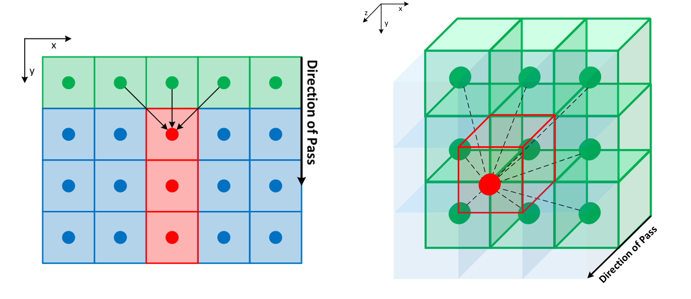

# Summary 

  
Geodesic and Euclidean distance transforms have been widely used in a number of applications where distance from a set of reference points is computed. Methods from recent years have shown effectiveness in applying the Geodesic distance transform to interactively annotate 3D medical imaging data [@wang2018deepigeos; @criminisi2008geos]. The Geodesic distance transform enables providing segmentation labels, i.e., voxel-wise labels, for different objects of interests. Despite existing methods for efficient computation of the Geodesic distance transform on GPU and CPU devices [@criminisiinteractive; @criminisi2008geos; @weber2008parallel; @toivanen1996new], an open-source implementation of such methods on the GPU does not exist. 
On the contrary, efficient methods for the computation of the Euclidean distance transform [@felzenszwalb2012distance] have open-source implementations [@tensorflow2015-whitepaper; @eucildeantdimpl]. Existing libraries, e.g., @geodistk, provide C++ implementations of the Geodesic distance transform; however, they lack efficient utilisation of the underlying hardware and hence result in significant computation time, especially when applying them on 3D medical imaging volumes.  

The `FastGeodis` package provides an efficient implementation for computing Geodesic and Euclidean distance transforms (or a mixture of both), targeting efficient utilisation of CPU and GPU hardware. In particular, it implements the paralellisable raster scan method from @criminisiinteractive, where elements in a row (2D) or plane (3D) can be computed with parallel threads. This package is able to handle 2D as well as 3D data, where it achieves up to a 20x speedup on a CPU and up to a 74x speedup on a GPU as compared to an existing open-source library [@geodistk] that uses a non-parallelisable single-thread CPU implementation. The performance speedups reported here were evaluated using 3D volume data on an Nvidia GeForce Titan X (12 GB) with a 6-Core Intel Xeon E5-1650 CPU. Further in-depth comparison of performance improvements is discussed in the `FastGeodis` \href{https://fastgeodis.readthedocs.io/}{documentation}. 

# Statement of need 
 
Despite existing open-source implementation of distance transforms [@tensorflow2015-whitepaper; @eucildeantdimpl; @geodistk], open-source implementations of efficient Geodesic distance transform algorithms [@criminisiinteractive; @weber2008parallel] on CPUs and GPUs do not exist. However, efficient CPU [@eucildeantdimpl] and GPU [@tensorflow2015-whitepaper] implementations exist for Euclidean distance transform. To the best of our knowledge, `FastGeodis` is the first open-source implementation of efficient the Geodesic distance transform [@criminisiinteractive], achieving up to a 20x speedup on a CPU and up to a 74x speedup on a GPU as compared to existing open-source libraries [@geodistk]. It also provides an efficient implementation of the Euclidean distance transform. In addition, it is the first open-source implementation of generalised Geodesic distance transform and Geodesic Symmetric Filtering (GSF) as proposed in @criminisi2008geos. Apart from a method from @criminisiinteractive, @weber2008parallel present a further optimised approach for computing Geodesic distance transforms on GPUs. However, this method is protected by multiple patents [@bronstein2013parallel; @bronstein2015parallel; @bronstein2016parallel] and hence is not suitable for open-source implementation in the **FastGeodis** package.
  

The ability to efficiently compute Geodesic and Euclidean distance transforms can significantly enhance distance transform applications, especially for training deep learning models that utilise distance transforms [@wang2018deepigeos]. It will improve prototyping, experimentation, and deployment of such methods, where efficient computation of distance transforms has been a limiting factor. In 3D medical imaging problems, efficient computation of distance transforms will lead to significant speed-ups, enabling online learning applications for better processing/labelling/inference from volumetric datasets [@asad2022econet].  In addition, `FastGeodis` provides an efficient implementation for both CPUs and GPUs and hence will enable efficient use of a wide range of hardware devices. 

  
# Implementation 

`FastGeodis` implements an efficient distance transform algorithm from @criminisiinteractive, which provides parallelisable raster scans to compute distance transform. The implementation consists of data propagation passes that are parallelised using threads for elements across a line (2D) or plane (3D). \autoref{fig:hwpasses} shows these data propagation passes, where each pass consists of computing distance values for the next row (2D) or plane (3D) by utilising parallel threads and data from the previous row/plane, hence resulting in propagating distance values along the direction of the pass. For 2D data, four distance propagation passes are required, top-bottom, bottom-top, left-right and right-left, whereas for 3D data six passes are required, front-back, back-front, top-bottom, bottom-top, left-right and right-left. The algorithm can be applied to efficiently compute both Geodesic and Euclidean distance transforms. In addition to this, `FastGeodis` also provides the non-parallelisable raster scan based distance transform method from @toivanen1996new, which is implemented using a single CPU thread and used for comparison.

The `FastGeodis` package is implemented using `PyTorch` [@NEURIPS2019_9015], utilising OpenMP for CPU- and CUDA for GPU-parallelisation of the algorithm. It is accessible as a Python package that can be installed across different operating systems and devices. Comprehensive documentation and a range of examples are provided for understanding the usage of the package on 2D and 3D data using CPUs or GPUs. Two- and three-dimensional examples are provided for Geodesic, Euclidean, and Signed Geodesic distance transforms as well as for computing Geodesic Symmetric Filtering (GSF), the essential first step in implementing the interactive segmentation method described in @criminisi2008geos. A further in-depth overview of the implemented algorithm, along with evaluation on common 2D/3D data input sizes, is provided in the `FastGeodis` \href{https://fastgeodis.readthedocs.io/}{documentation}.

  

{ width=80% } 

# Acknowledgements

This research was supported by the European Union’s Horizon 2020 research and innovation programme under grant agreement No 101016131. 

# References
